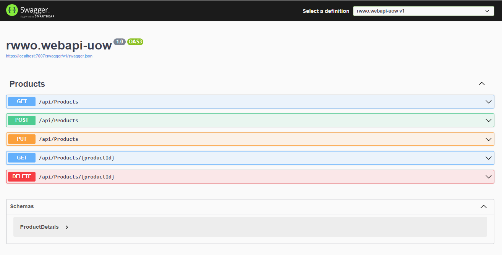

# rwwo.webapi-uow

## Padrão de Repositório

# Definição e propósito.
* Redução da duplicação de código e aderência ao princípio DRY.
* Criação de uma camada de separação entre as camadas de acesso a dados e de negócios.
* Facilitação da manutenção de código.
* Eficiência na escrita de casos de teste de unidade.

# Unit of Work (Unidade de Trabalho)
* Abordagem de possíveis atualizações parciais de dados em grandes aplicações.
* Gerenciamento de um contexto de banco de dados compartilhado para evitar problemas de concorrência.
* Garantia de integridade de dados com transações.
* Desacoplamento de camadas usando injeção de dependência.
* Alinhamento com os princípios do Desenvolvimento Orientado a Testes (TDD).

# Implementação Passo a Passo
 Guia detalhado sobre como incorporar o Padrão de Repositório e Unit of Work em seu projeto de Web API .NET Core 6.

## Pré-requisitos
Antes de começar, certifique-se de ter as seguintes ferramentas e dependências instaladas:
* Visual Studio 2022
* Postgres
* .NET Core 6 SDK

## Padrão de Repositório
O Padrão de Repositório estabelece uma camada de abstração entre as camadas de acesso a dados e de negócios, promovendo a reutilização e a manutenibilidade do código. Ele ajuda a criar uma separação de preocupações e facilita a eficiente escrita de testes de unidade.

## Unit of Work (Unidade de Trabalho)
Enquanto o Padrão de Repositório ajuda na abstração do código, uma Unidade de Trabalho é essencial para manter a integridade dos dados, especialmente em cenários onde vários repositórios compartilham o mesmo contexto de banco de dados. Ela gerencia transações, evita atualizações parciais e garante consistência.

> [!NOTE]
> Projeto desenvolvido para fins de estudos.

